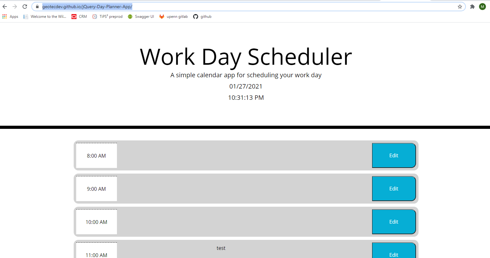

jQuery-Day-Planner-App
Web app that allows users to save notes to an interactive ui, built with jQuery

Application Description
This web app displays an activity planner with 13 time blocks--each representing one hour between 8 AM and 8 PM. In the script.js file, there is a function that sets conditional formatting on the time blocks based on the current time. The function is called once in the initial load method, and again periodically every 5 minutes from inside the startPlannerTime() function. To edit the note textarea on a given time block, the user can click the button in the left side of the row. Once they have edited the text, they can click the button again to set the textarea back to 'disabled' and save changes to the planner data to local storage.

Application Notes
time conditional updates to the ui are set in the main function startPlannerTime() which runs on an unlimited interval. I used moment js to impliment the time/timestamp based features in this application. Originally, I wrote the logic in vanilla javascript, but I switched to jQuery selectors and methods where applicable for the final version.

Link to Deployed Application
https://geotecdev.github.io/jQuery-Day-Planner-App/

Link to Github Repository
https://github.com/geotecdev/jQuery-Day-Planner-App

main page appearance (screenshot)
A static image of the completed landing page can be found at the link below

#Licence MIT License

Copyright (c) 2021 Mike Ruane (geotecdev)

Permission is hereby granted, free of charge, to any person obtaining a copy of this software and associated documentation files (the "Software"), to deal in the Software without restriction, including without limitation the rights to use, copy, modify, merge, publish, distribute, sublicense, and/or sell copies of the Software, and to permit persons to whom the Software is furnished to do so, subject to the following conditions:

The above copyright notice and this permission notice shall be included in all copies or substantial portions of the Software.

THE SOFTWARE IS PROVIDED "AS IS", WITHOUT WARRANTY OF ANY KIND, EXPRESS OR IMPLIED, INCLUDING BUT NOT LIMITED TO THE WARRANTIES OF MERCHANTABILITY, FITNESS FOR A PARTICULAR PURPOSE AND NONINFRINGEMENT. IN NO EVENT SHALL THE AUTHORS OR COPYRIGHT HOLDERS BE LIABLE FOR ANY CLAIM, DAMAGES OR OTHER LIABILITY, WHETHER IN AN ACTION OF CONTRACT, TORT OR OTHERWISE, ARISING FROM, OUT OF OR IN CONNECTION WITH THE SOFTWARE OR THE USE OR OTHER DEALINGS IN THE SOFTWARE.